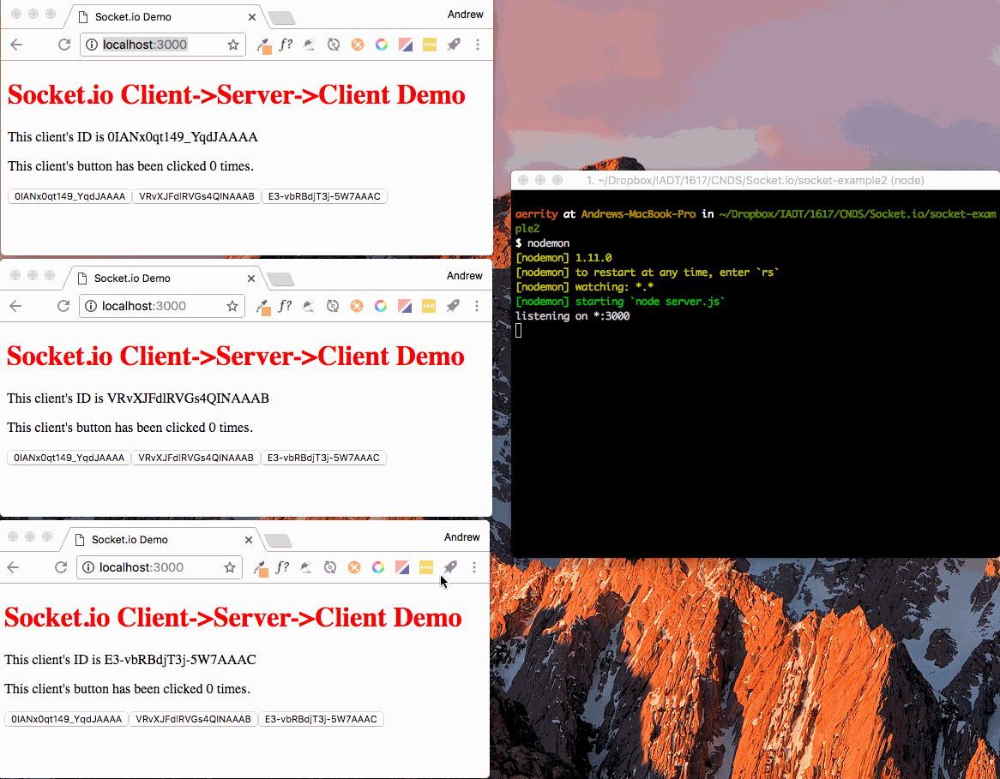

# Sending messages to individual clients using Socket.io

This tutorial will talk you through how to send messages from one client to another (via the server) using [Socket.io](https://socket.io).

For a detailed description of how to setup a [Node.js](https://nodejs.org/) project and develop a client-server web application using [Express](https://www.expressjs.com) and [Socket.io](https://socket.io) see my previous [Socket Example](https://github.com/aerrity/socket-click-example).


## Getting started

As before, create a folder to store the project and change directory so you are in the project folder, e.g.

	mkdir socket-example2
	cd socket-example2
	
Run `npm init .` which will help you to setup your project and create a `package.json` file in your project folder.

Install Express and Socket.io:

	npm install express --save
	npm install socket.io --save
	

### A note on proxy servers

If the above commands fail and you are working from within IADT you may need to configure `npm` to access the Internet via IADT's proxy server. To do this type:

	npm config set proxy http://merlin:8080
	
Should you ever need to unset this, e.g. if you are working on a laptop and want to work at home, you can run:

	npm config delete proxy

## Server-side - Part 1 - List of clients

Create a `server.js` file containing the following:

```js
// server.js
var express = require('express');  
var app = express();  
var server = require('http').createServer(app); 
var io = require('socket.io')(server); 

app.use(express.static(__dirname + '/public')); 
//redirect / to our index.html file

app.get('/', function(req, res,next) {  
    res.sendFile(__dirname + '/public/index.html');
});

io.on('connection', function(client) {  
	console.log('client connected');
});

//start our web server and socket.io server listening
server.listen(3000, function(){
  console.log('listening on *:3000');
}); 
```

We will then add a function inside the Socket.io connection function above. This function will send an array containing the client IDs of all the clients connected to the server out to all the connected clients. 

```js
io.on('connection', function(client) {
	console.log('client connected');
	
	//when a new client connects
	io.clients(function(error, clients){
	  if (error) throw error;
		//send the list of clients out to all the clients
		io.emit('clientList', clients);
	});
});
```

Each client in Socket.io has a unique ID. So if there were 3 clients connected the `clients` array above might contain `[ 'wFCPkp1R33tO6sDOAAAA',  'mUNCRLPjy_-iGOeAAAAB',  'u38VgszMfSTMd-r6AAAC' ]`.


## Client-side - Part 1 - List of clients

Create an `index.html` file in a `public` folder in your project folder containing:

```html
<!DOCTYPE html>
<html>
   <head>
      <title>Socket.io Demo</title>
      <meta charset="utf-8">
		<link rel="stylesheet" href="styles.css">
   </head>
   <body>
		 <h1>Socket.io Client->Server->Client Demo</h1>
		 <p id="clientId"></p>
		 <p id="buttonCount">This client's button has been clicked 0 times.</p>
		 <div id="clients"></div>

		 <script src="/socket.io/socket.io.js"></script>
		 <script>
			 var socket = io.connect();
			 
			 //Once we're connected, display the client ID on the webpage
			 socket.on('connect', function(){
			  	document.getElementById("clientId").innerHTML = "This client's ID is " + socket.id;
			 });
			 			 
			 //Add a button for each client that is connected to the server
			 socket.on('clientList', function(data){
				 document.getElementById("clients").innerHTML = "";
				 for(var i = 0; i < data.length; i++){
					 //console.log(data[i]);
					 var btn = document.createElement("BUTTON"); 
					 btn.onclick = clientButtonClicked;
					 var textnode = document.createTextNode(data[i]);
					 btn.appendChild(textnode);
					 document.getElementById("clients").appendChild(btn);
				 }
			 });
			 
			 //When any of the client buttons on this page are clicked
			 function clientButtonClicked(){
				 //Tell the server this button was clicked and send the client id along with the message
				 socket.emit('clientClicked', this.innerHTML);
			 }
		</script>
   </body>
</html>
```

This page connects to the Socket.io server we created above using `var socket = io.connect();`. Once connected it will display this client's ID on the page.

```js
//Once we're connected, display the client ID on the webpage
socket.on('connect', function(){
	document.getElementById("clientId").innerHTML = "This client's ID is " + socket.id;
});
```

The next JS function handles the `'clientList'` message that is sent from the server. It loops through the array of client IDs and adds a button for each ID, e.g. `'wFCPkp1R33tO6sDOAAAA'`.

```js
//Add a button for each client that is connected to the server
socket.on('clientList', function(data){
	document.getElementById("clients").innerHTML = "";
	for(var i = 0; i < data.length; i++){
		//console.log(data[i]);
		var btn = document.createElement("BUTTON"); 
		btn.onclick = clientButtonClicked;
		var textnode = document.createTextNode(data[i]);
		btn.appendChild(textnode);
		document.getElementById("clients").appendChild(btn);
	}
});
```

Finally there is an `onclick` handler for the buttons. When any of the buttons is clicked this sends a message to the server along with the client ID (e.g. `'wFCPkp1R33tO6sDOAAAA'`) from the button that was clicked.

```js
//When any of the client buttons on this page are clicked
function clientButtonClicked(){
	//Tell the server this button was clicked and send the client id along with the message
	socket.emit('clientClicked', this.innerHTML);
}
```

## Server-side - Part 2 - Handling client-client messages
We will now add another function inside the Socket.io connection function:

```js
io.on('connection', function(client) {  
	console.log('client connected');
	//when a new client connects
	io.clients(function(error, clients){
	  if (error) throw error;
		//send the list of clients out to all the clients
		io.emit('clientList', clients);
		console.log(clients);
	});
	
	//when the server receives clientClicked message, do this
	client.on('clientClicked', function(id) {
		//send a message to just the client whose button was clicked
		io.to(id).emit('youWereClicked');
	});
});
```

The `'clientClicked'` message handler triggers a message to be sent to just the client whose button was clicked, e.g. `'wFCPkp1R33tO6sDOAAAA'`.

## Client-side - Part 2 - Updating the click count

Each client will keep track of how many times their button was clicked by any of the clients. We will do this by declaring and initialising a variable after connecting to the Socket.io server `var clicked = 0;`.

We will then add a function that handles `'youWereClicked'` messages from the server. When a client is told that their button was clicked, they update their counter and display it on the page.

```js
//what to do when the server tells this client their button was clicked by any of the clients
socket.on('youWereClicked', function(){
	//console.log('clicked');
	clicked++;
	document.getElementById("buttonCount").innerHTML = "This client's button has been clicked " + clicked + ' times.';
});
```

## The result

Final code for [index.html](https://github.com/aerrity/socket-click-example2/blob/master/index.html) and [server.js](https://github.com/aerrity/socket-click-example2/blob/master/server.js).

Following the above steps should result in the following behaviour:




# Taking this a step further

Can you modify this example so that there is a text input field in the client, and when a user types a message in the input field and clicks a 'send to [clientid]' button the text they typed in is sent to just one of the other connected clients and displayed on the webpage? This would be a step towards a one-to-one direct messaging app.